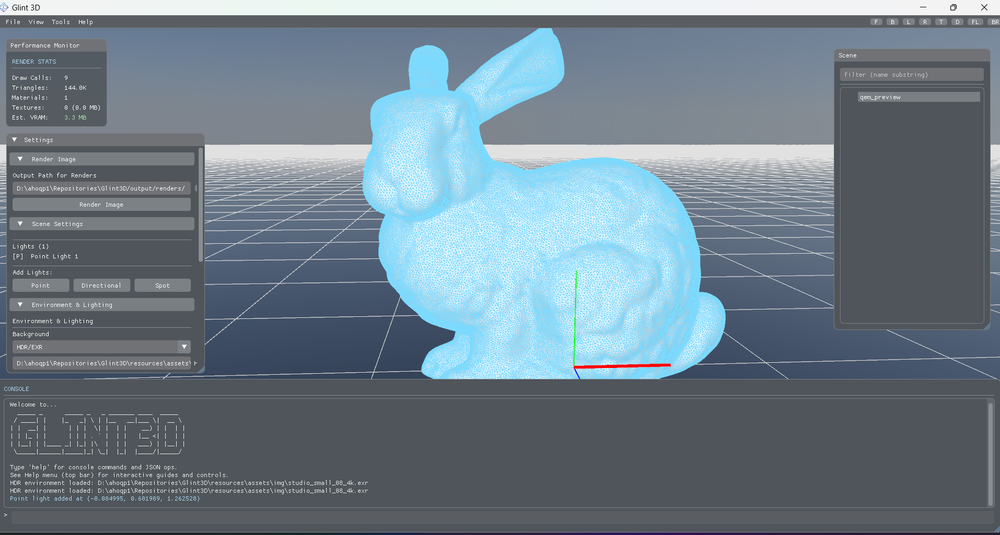

# Glint3D

```text
Welcome to...
    _____ _      _____ _   _ _______ ____  _____
   / ____| |    |_   _| \ | |__   __|___ \|  __ \
  | |  __| |      | | |  \| |  | |    __) | |  | |
  | | |_ | |      | | | . ` |  | |   |__ <| |  | |
  | |__| | |____ _| |_| |\  |  | |   ___) | |__| |
   \_____|______|_____|_| \_|  |_|  |____/|_____/

```

Glint3D is a C++ 3D engine focused on interactive desktop rendering and automation-friendly CLI workflows. It supports real-time OpenGL rendering, CPU raytracing, JSON-driven operations, and headless output generation.



## Highlights

- Dual rendering paths: OpenGL rasterization and CPU raytracing
- PBR material workflow (metallic/roughness)
- JSON Ops pipeline for scripted scene actions and rendering
- Headless rendering support for automation and batch jobs
- Asset import via Assimp (OBJ / glTF / FBX / PLY and more)
- Modular engine layout (`core`, `modules`, `platform`)


## Install / Build

### Prerequisites

- CMake (3.15+)
- A C++17 compiler (MSVC recommended on Windows)
- Platform dependencies listed in `docs/external_dependencies.md`

### Build (Windows / PowerShell)

```powershell
git clone <your-fork-or-repo-url>
cd Glint3D
cmake -S . -B builds/desktop/cmake -DCMAKE_BUILD_TYPE=Release
cmake --build builds/desktop/cmake --config Release
```

Output binary (typical):

- `builds/desktop/cmake/Release/glint.exe`

## Run

### Interactive UI

```powershell
.\builds\desktop\cmake\Release\glint.exe
```

### CLI Help

```powershell
.\builds\desktop\cmake\Release\glint.exe help
```

### JSON Ops / Headless Render (legacy-compatible flags)

```powershell
.\builds\desktop\cmake\Release\glint.exe --ops .\path\to\ops.json --render .\output.png
.\builds\desktop\cmake\Release\glint.exe --ops .\path\to\ops.json --render .\output.png --raytrace --denoise
```

## Using Glint3D (Overview)

Glint3D can be used in two primary ways:

- Interactive mode: launch the desktop app to inspect scenes, tweak rendering, and work visually.
- CLI mode: run commands and JSON Ops for automation, reproducible renders, and tooling integration.

Common workflows:

1. Build `glint.exe`.
2. Launch the UI for interactive work.
3. Use CLI commands (`help`, `init`, `render`, `ops`) for scripted tasks.
4. Use `schemas/json_ops_v1.json` to validate or author JSON Ops inputs.

## Project Layout

```text
engine/
  core/               Core rendering, scene, IO, and application systems
  modules/            Optional engine modules (raytracing, gizmos, post FX)
  platform/desktop/   Desktop UI and native platform integration

resources/
  assets/             Runtime assets and icons
  shaders/            GLSL shader sources
  templates/          Project scaffolding templates

cli/                  CLI command platform implementation
schemas/              JSON schemas (including JSON Ops)
docs/                 Project and dependency documentation
```

## JSON Ops

Glint3D supports JSON-based scripted operations for loading, scene edits, and rendering.

- Schema: `schemas/json_ops_v1.json`
- Use with: `glint --ops <file> --render <output.png>`

## Notes

- The built-in CLI banner/help reflects the current command platform and available subcommands.
- Some commands shown in help may be in-progress depending on your local branch/build state.

## License

License information is not yet published in this repository.
