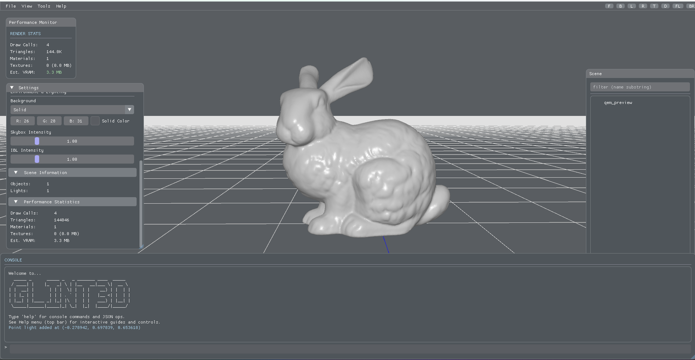

# Glint3D

```text
Welcome to...
    _____ _      _____ _   _ _______ ____  _____
   / ____| |    |_   _| \ | |__   __|___ \|  __ \
  | |  __| |      | | |  \| |  | |    __) | |  | |
  | | |_ | |      | | | . ` |  | |   |__ <| |  | |
  | |__| | |____ _| |_| |\  |  | |   ___) | |__| |
   \_____|______|_____|_| \_|  |_|  |____/|_____/

```

Glint3D is a lightweigth 3D engine built for human and AI + automation driven workflows, combining an easy-to-use UI with an automation grade CLI for fast rendering, scripting, and visual iteration.

**UI:**




**CLI:** `glint simplify --10 --animate` =


Made with my own QEM algorithm!!

## Highlights

- JSON Ops pipeline for scripted scene actions and rendering
- Headless rendering support for automation and batch jobs
- Asset import via Assimp (OBJ / glTF / FBX / PLY and more)

## Install / Build

### Prerequisites

- CMake (3.15+)
- A C++17 compiler (MSVC recommended on Windows)
- Platform dependencies listed in `docs/external_dependencies.md`

### Build (Windows / PowerShell)

```powershell
git clone <your-fork-or-repo-url>
cd Glint3D
cmake -S . -B builds/desktop/cmake -DCMAKE_BUILD_TYPE=Release
cmake --build builds/desktop/cmake --config Release
```

Output binary (typical):

- `builds/desktop/cmake/Release/glint.exe`

## Run

```powershell
glint ui
glint help
glint init my_project
glint render --input scene.obj --output img.png
glint ops .\path\to\ops.json --render .\output.png --raytrace --denoise
```

If `glint` is not on your `PATH`, run `.\builds\desktop\cmake\Release\glint.exe`.

## Using Glint3D (Overview)

- Interactive UI: `glint ui`
- CLI workflows: `glint help`, `glint render`, `glint ops`, `glint init`
- JSON Ops schema: `schemas/json_ops_v1.json`

## Project Layout

```text
engine/
  core/               Engine systems
  modules/            Optional modules
  platform/desktop/   Desktop UI/platform layer

resources/
  assets/             Images, videos, icons
  shaders/            Shader sources
  templates/          Scaffolding templates

cli/                  CLI command platform
schemas/              JSON schemas
docs/                 Documentation
```

## JSON Ops

- Schema: `schemas/json_ops_v1.json`
- Run: `glint ops <file> --render <output.png>`

## Notes

- Use `glint help` for the current command list.
- Some commands may still be in progress depending on branch state.
